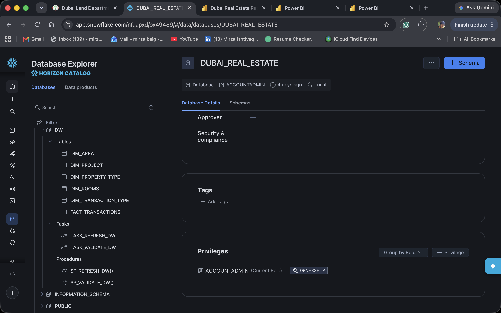
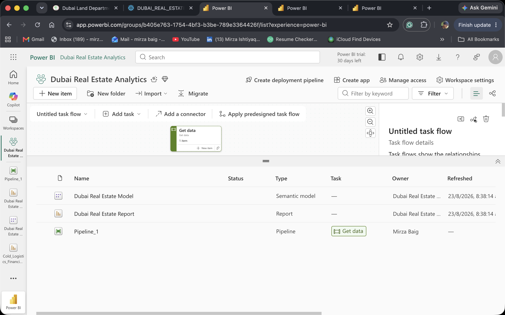
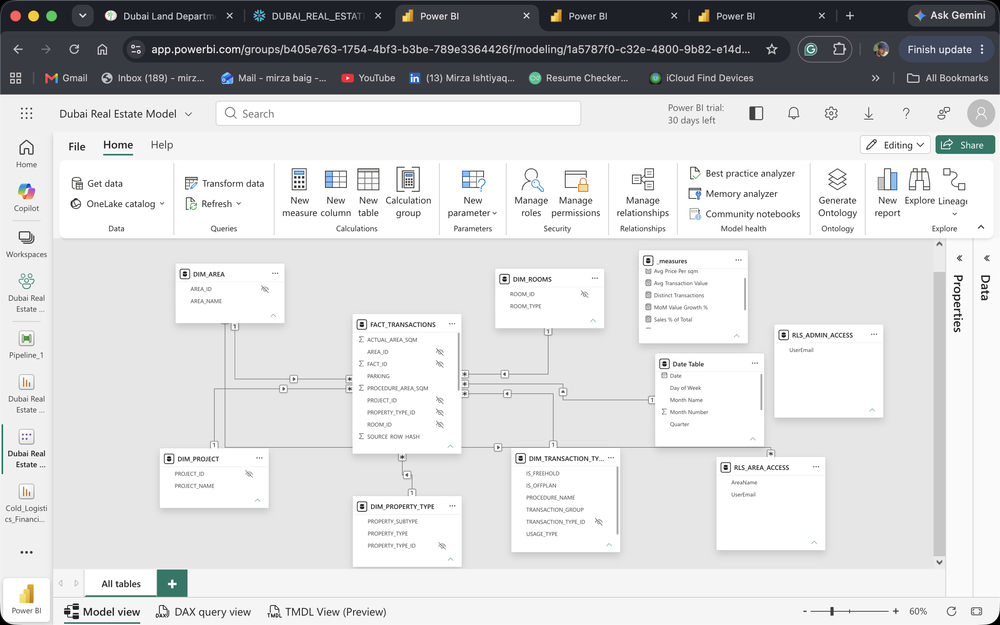
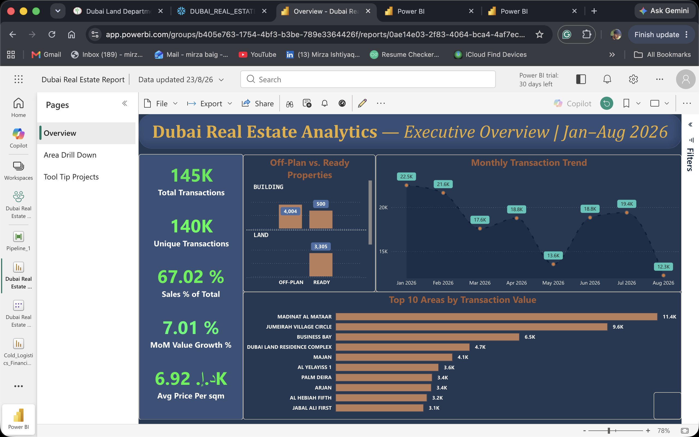
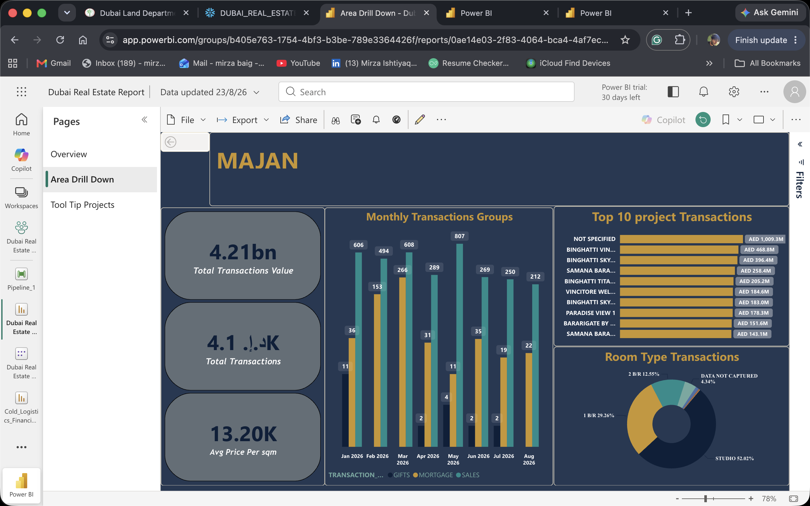
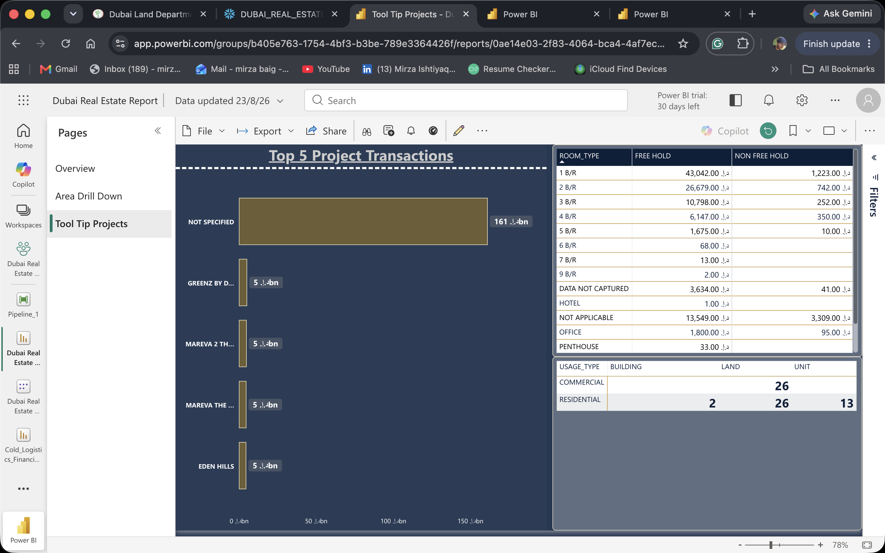

# 🏗️ Dubai Real Estate Analytics — Enterprise BI Pipeline

**Five-layer enterprise BI pipeline on Dubai Land Department open data — Snowflake star schema, Fabric semantic model with Row-Level Security, Power BI dashboard, and automated orchestration.**

[](https://www.snowflake.com/)
[](https://powerbi.microsoft.com/)
[](https://www.microsoft.com/en-us/microsoft-fabric)
[](https://www.python.org/)

---

## 📸 Dashboard Preview

<p align="center">
  
</p>

<details>
<summary><b>View all dashboard pages</b></summary>

<p align="center">
  <br/><br/>
  <br/><br/>
  <br/><br/>
  <br/><br/>
  
</p>

</details>

## 📋 Overview

An end-to-end data engineering and BI project built on **real government open data** from the [Dubai Land Department (DLD)](https://dubailand.gov.ae/en/open-data/real-estate-data/). The pipeline processes 140,000+ property transaction records through five layers:

```
Source CSV → Snowflake Staging → Snowflake Data Warehouse (star schema)
→ Microsoft Fabric Semantic Model → Power BI Dashboard
→ Orchestration (Snowflake Tasks + Fabric Data Factory)
```

## ⭐ Key Highlights

| Area | What I Built |
|------|-------------|
| **Data Modeling** | Kimball-style star schema with 5 dimension tables and 1 fact table, with documented grain and cleaning rationale per table |
| **Data Engineering** | Python incremental loader using Snowflake PUT + COPY INTO for efficient bulk ingestion |
| **SQL** | Production-grade DDL with CTEs, TRY_TO_* type-safe casts, COALESCE/NULLIF null handling, and multi-column composite joins |
| **Semantic Layer** | Microsoft Fabric semantic model with DAX measures and Row-Level Security via bridge table |
| **Visualization** | Multi-page Power BI dashboard with custom theme, KPI cards, drill-through, and slicers |

## 🏛️ Architecture

```
┌─────────────────┐     ┌──────────────────────┐     ┌──────────────────────┐
│   DLD Open Data │────▶│   Snowflake RAW       │────▶│   Snowflake DW       │
│   (CSV export)  │     │   TRANSACTIONS_STAGING │     │   Star Schema        │
└─────────────────┘     └──────────────────────┘     └──────────┬───────────┘
                                                                │
                        ┌──────────────────────┐                │
                        │   Power BI Dashboard │◀───────────────┤
                        │   (published report) │     ┌──────────┴───────────┐
                        └──────────────────────┘     │   Microsoft Fabric   │
                                                     │   Semantic Model     │
                                                     │   (DirectQuery + RLS)│
                                                     └──────────────────────┘
```

### Star Schema

```
                    ┌─────────────────┐
                    │   DIM_AREA      │
                    │   (272 areas)   │
                    └────────┬────────┘
┌───────────────────┐        │        ┌──────────────────────┐
│ DIM_PROPERTY_TYPE │        │        │ DIM_TRANSACTION_TYPE │
│ (type + subtype)  │────────┼────────│ (5-field composite)  │
└───────────────────┘        │        └──────────────────────┘
                    ┌────────┴────────┐
                    │FACT_TRANSACTIONS│
                    │ (140K+ rows)    │
                    └────────┬────────┘
┌───────────────────┐        │        ┌──────────────────────┐
│   DIM_ROOMS       │        │        │   DIM_PROJECT        │
│ (room configs)    │────────┘        │ (developments)       │
└───────────────────┘                 └──────────────────────┘
```

## 📂 Repository Structure

```
dubai-real-estate-analytics/
├── README.md
├── .gitignore
├── snowflake/
│   ├── 01_data_warehouse_pipeline.sql      # One-time DDL: database, schemas, 5 dimensions, fact table
│   └── analysis/
│       └── exploratory_queries.sql          # Ad-hoc profiling & validation queries
├── automation/
│   └── load_new_dld_data.py                # Python incremental CSV → Snowflake loader (PUT + COPY INTO)
├── powerbi/
│   └── README.md                           # Fabric semantic model & theme notes
└── docs/
    └── images/                             # Dashboard screenshots
```

## 🔧 Setup & Usage

### Prerequisites

- Snowflake account with `COMPUTE_WH` warehouse
- Python 3.9+ with `snowflake-connector-python` and `pandas`
- Microsoft Fabric workspace (for semantic model)
- Power BI Desktop (for report development)

### 1. Build the Data Warehouse

Run the DDL script against your Snowflake account:

```sql
-- Execute in Snowflake worksheet
-- Creates database, schemas, 5 dimension tables, and the fact table
@snowflake/01_data_warehouse_pipeline.sql
```

### 2. Load Transaction Data

```bash
# Set credentials as environment variables
export SNOWFLAKE_ACCOUNT='your_account_identifier'
export SNOWFLAKE_USER='your_username'
export SNOWFLAKE_PASSWORD='your_password'

# Run the loader
python automation/load_new_dld_data.py
```

### 3. Connect Power BI

1. Open the `.pbix` file (not tracked in Git — see `powerbi/README.md`)
2. Update the Snowflake connection to point to your warehouse
3. Publish to Fabric workspace for semantic model + RLS

## 📊 Data Source

**Dubai Land Department (DLD) Open Data Portal**
- URL: [dubailand.gov.ae/en/open-data/real-estate-data/](https://dubailand.gov.ae/en/open-data/real-estate-data/)
- Records: 140,000+ property transactions
- Fields: 22 columns including transaction details, property attributes, location, and parties
- License: Government open data (public domain)

## 🧠 Design Decisions

Documented in detail within the SQL comments. Key choices:

1. **Dropped 3 location columns** (NEAREST_METRO/MALL/LANDMARK) — 50–70% null, too sparse for reliable dimension
2. **Dropped MASTER_PROJECT_EN** — 99.6% null (503 of 142K rows populated)
3. **PARKING as degenerate dimension** — values are near-unique spot numbers (P-132, G-11), not a category
4. **Separate null treatments in DIM_ROOMS** — blank (= land, structurally N/A) vs literal "NA" (= unit, data gap)
5. **TRY_TO_* casts throughout** — one malformed row returns NULL, not a failed build

## 📝 License

This project is for portfolio and educational purposes. The underlying data is sourced from the Dubai Land Department's public open data portal.

---

*Built by [Mirza Ishtiyaq Baig](https://github.com/mirza-ishtiyaq) — Data Analyst | BI Developer*
